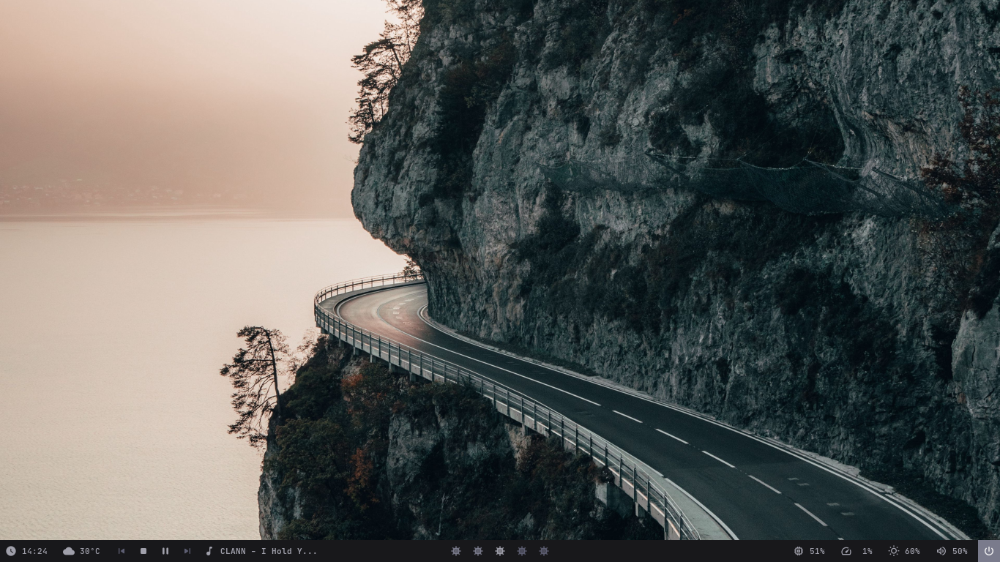
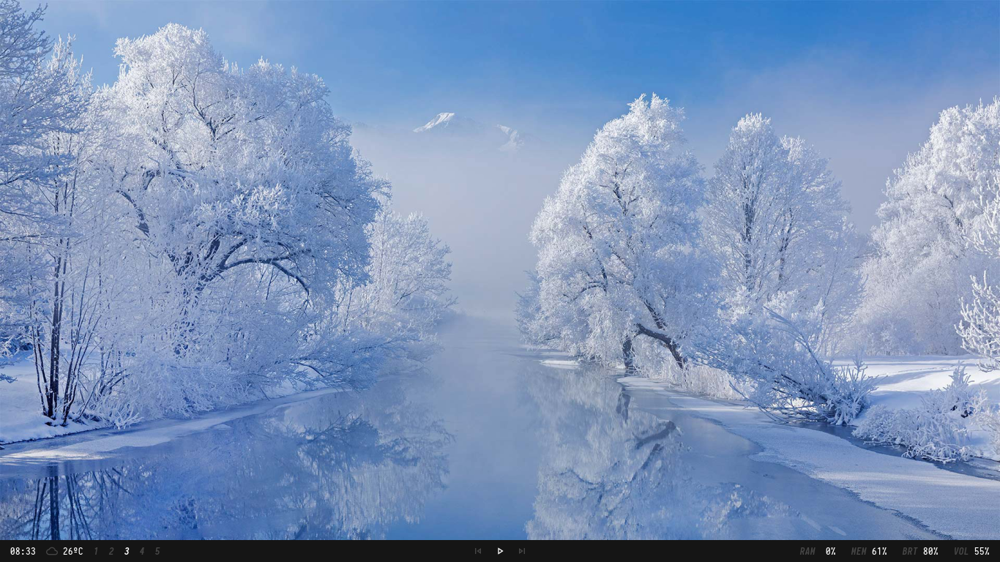

# Custom Polybar

Ma collection personnelle. J'essaie de créer des thèmes sympas et de montrer à quel point [Polybar](https://github.com/polybar/polybar) est génial. Je continuerai à mettre à jour la collection et peut-être à créer des scripts personnalisés pour que nous puissions tous en profiter davantage. Je vous recommande également de consulter cette [cette Collection Polybar de adi1090x](https://github.com/adi1090x/polybar-themes), qui propose de superbes thèmes. Si ma collection ne vous plaît pas, vous pouvez jeter un œil à celle-ci.

Je veux que vous ayez plus d'options et d'idées pour créer votre propre thème. Notez également que j'ai pris le repo de [Murzchnvok Polybar Collection](https://github.com/Murzchnvok/polybar-collection) afin de le personnaliser à ma manière.
Merci à lui pour ces efforts

Read this README with attention.

## Getting Started

### Prerequisites

First of all, install Polybar:

[Compiling Polybar](https://github.com/polybar/polybar/wiki/Compiling)

By default the font used is `JetBrainsMono` (you can change it in the **fonts.ini** file), you can download and install from [NerdFonts](https://www.nerdfonts.com/font-downloads):

Also you'll need [MaterialIcons](https://github.com/google/material-design-icons) and [Feather](https://feathericons.com/).
You can move both **MaterialIcons** and **feather** inside **fonts** to **$HOME/.fonts/** and run:

```bash
$HOME
-> fc-cache -fv
```

or just search how to install fonts!

### Cloning

Now you need to clone the repo in the \$HOME directory (because the path inside the files points to **$HOME/custom-polybar**):

```bash
$HOME
-> git clone --depth 1 https://github.com/BoubakarPI/custom-polybar
```

or clone to other directory and create a symlink of the folder in the \$HOME directory:

```bash
$HOME/Projects
-> git clone --depth 1 https://github.com/BoubakarPI/custom-polybar

$HOME
-> ln -s $HOME/Projects/custom-polybar $HOME/custom-polybar
```

### Running

BSPwm

```bash
$HOME/custom-polybar/launch.sh
```

I3wm

```bash
exec_always --no-startup-id $HOME/custom-polybar/launch.sh
```

Remember to keep updated:

```bash
$HOME
-> cd $HOME/custom-polybar && git pull
```

## Few changes

Now we only have one file **modules.ini** to change the modules that we like to use. I believe that's a better way to configure our Polybar themes:

```ini
modules-left = date wallz nft tor weather bspwm i3
modules-center = mpd
modules-right = wired cpu memory xbacklight pulseaudio
```

The only problem with this, is that some themes don't have certain modules, for now at least! I'm planning on making this collection easier to setup, so if you have any ideas you can always share.

## Weather app

As pointed out by Dennis Perrone, my personal OpenWeather API Key is in the project as a constant, and I did this intentionally so it just works, and it's fine if you want to use it the same as me, but I'll suggest you to create your own API Key for free in the official [OpenWeather](https://openweathermap.org/api) website. There's a limit of requests you can make using the same API Key, so we both could be without the weather info if a lot of requests are made.

After you create your API Key, you can pass as an argument in the **weather.sh** script, or you can set an environment variable for **OPENWEATHER_API_KEY** with your own API Key:

## Wallz

Still thinking about this one, maybe I should add more 'backend' options, for now is only using Bing API, but I could add more options since Bing API have a 'limited', but with a really good quality, wallpapers collection. For now I'll be only using on minimal theme, but when I'm 'done' I'll add to the others.


_Enjoy!_

### Murz


```ini
modules-left = date weather round-right
modules-center = round-left bspwm round-right
modules-right = round-left mpd
```

### Chnvok



```ini
modules-left = date weather mpd
modules-center = bspwm
modules-right = memory cpu xbacklight pulseaudio session
```

### Dracula


```ini
modules-left = date margin weather margin mpd
modules-center = bspwm
modules-right = memory margin cpu margin xbacklight margin pulseaudio margin battery margin session
```

### Gruvbox


```ini
modules-left = bspwm
modules-center = round-left-blue weather date round-right-blue margin round-left mpd round-right
modules-right = cpu memory pulseaudio xbacklight
```

### Lofi


```ini
modules-left = bspwm
modules-center = mpd
modules-right = date weather
```

### Material


```ini
modules-left = weather margin date margin mpd tri-upper-right tri-lower-left bspwm tri-upper-right
modules-center =
modules-right = memory margin cpu margin xbacklight margin pulseaudio
```

### Minimal



```ini
modules-left = date weather bspwm
modules-center = mpd
modules-right = cpu memory xbacklight pulseaudio
```

### Nord


```ini
modules-left = date margin weather margin mpd round-right
modules-center = trap-left bspwm trap-right
modules-right = memory margin cpu margin xbacklight margin pulseaudio margin wallz margin session
```

### One Dark


```ini
modules-left = bspwm margin date margin weather margin mpd
modules-center =
modules-right = cpu margin memory margin pulseaudio margin xbacklight margin wallz margin session
```
